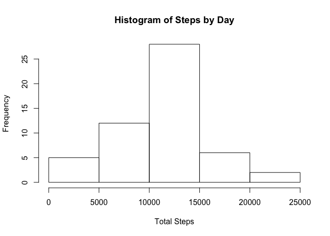
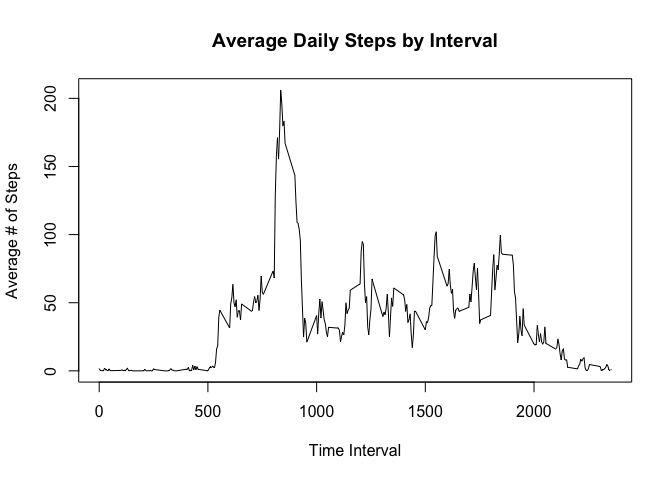
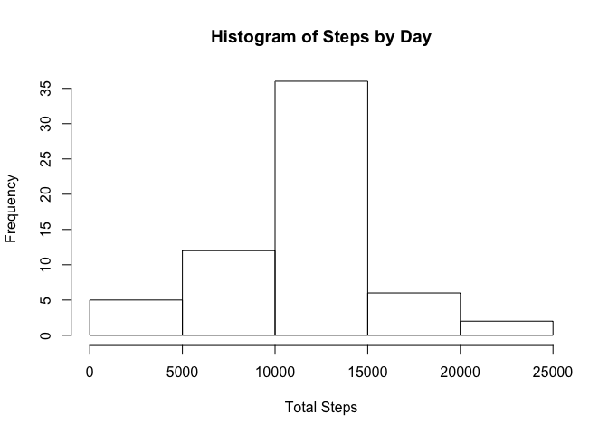
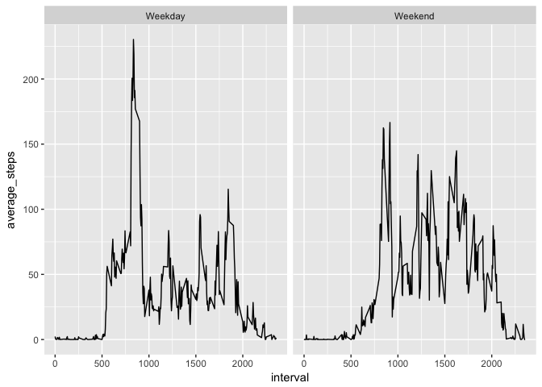

## Loading and preprocessing the data

Unzip the activity.zip file and read in the resulting activity.csv file. Finally, clean up the activity.csv file.


```r
if(file.exists("activity.zip")) {
    unzip("activity.zip")
}

if(file.exists("activity.csv")) {
    activity <- read.csv("activity.csv")
    file.remove("activity.csv")
}
```


## What is mean total number of steps taken per day?

```r
library(dplyr)
byDay <- na.omit(activity) %>% 
    group_by(date) %>% 
    summarise(total_steps = sum(steps))
hist(byDay$total_steps,
     main= "Histogram of Steps by Day",
     ylab = "Frequency",
     xlab = "Total Steps")
```

<!-- -->

```r
mean_steps <- mean(byDay$total_steps)
median_steps <- median(byDay$total_steps)
```

The mean of the total steps is 1.0766189\times 10^{4} and the median is 10765.


## What is the average daily activity pattern?

```r
byInterval <- activity %>% 
    na.omit() %>%
    group_by(interval) %>% 
    summarise(average_steps = mean(steps))
plot(byInterval, 
     type="l",
     main="Average Daily Steps by Interval",
     ylab = "Average # of Steps",
     xlab = "Time Interval")
```

<!-- -->

```r
max_interval <- byInterval[which.max(byInterval$average_steps),]$interval
max_steps <- round(byInterval[which.max(byInterval$average_steps),]$average_steps,0)
```

The 5 minute interval with the most steps is 835 with an average of 206 steps.


## Imputing missing values

First, let's see how big the problem is.  


```r
library(knitr)
NA_Table <- data.frame(Columns=names(activity), 
           NA_Values = c(sum(is.na(activity$steps)), sum(is.na(activity$date)), sum(is.na(activity$interval))))
kable(NA_Table)
```


Columns     NA_Values
---------  ----------
steps            2304
date                0
interval            0

Ok. So we have a lot of missing values in the steps column. Lets impute these values using the mean for the interval.


```r
library(dplyr)
impute.mean <- function(x) replace(x, is.na(x), round(mean(x, na.rm = TRUE),0))
activity <- activity %>% 
    group_by(interval) %>%
    mutate( steps = impute.mean(steps) )
```

Let's see what that did to the distribution of steps.


```r
library(dplyr)
byDay <- na.omit(activity) %>% 
    group_by(date) %>% 
    summarise(total_steps = sum(steps))
hist(byDay$total_steps,
     main= "Histogram of Steps by Day",
     ylab = "Frequency",
     xlab = "Total Steps")
```

<!-- -->

```r
mean_steps <- mean(byDay$total_steps)
median_steps <- median(byDay$total_steps)
```

## Are there differences in activity patterns between weekdays and weekends?

```r
library(lubridate)
library(dplyr)
library(ggplot2)
activity$weekday <- case_when(
    wday(as.Date(activity$date), label=TRUE) == "Sat" | 
        wday(as.Date(activity$date), label=TRUE) == "Sun" ~ "Weekend", 
    TRUE ~ "Weekday")
byIntervalByWeekday <- activity %>% 
    group_by(interval, weekday) %>% 
    summarise(average_steps = mean(steps))
ggplot(data=byIntervalByWeekday) + 
    geom_line(aes(x=interval, y=average_steps)) + 
    facet_grid(. ~ weekday)
```

<!-- -->
